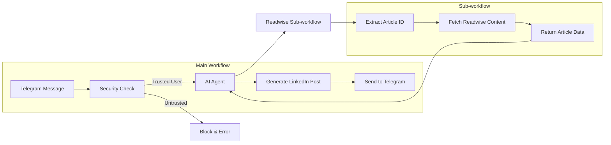
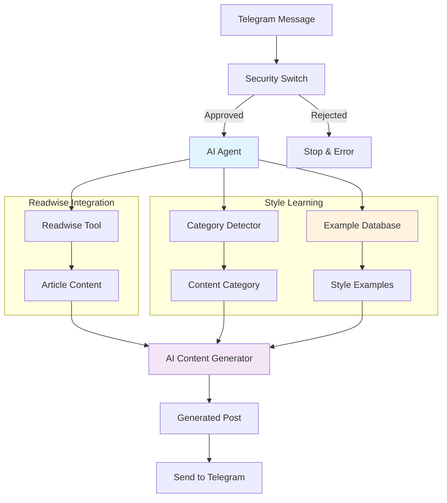
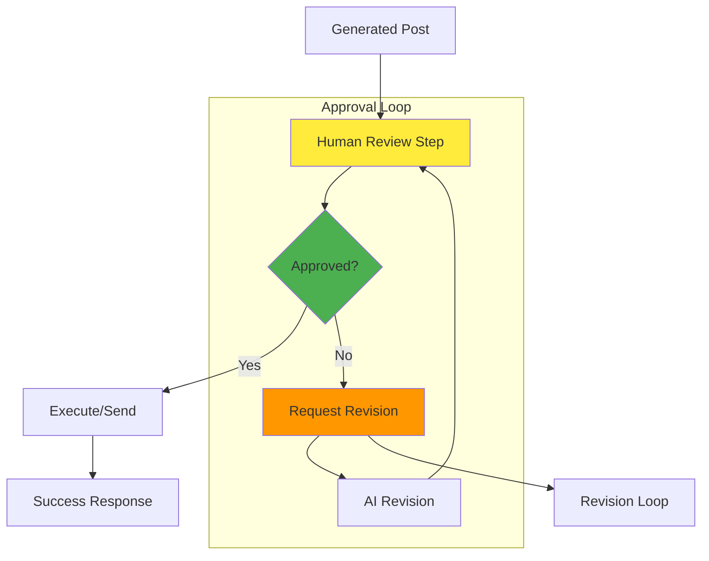
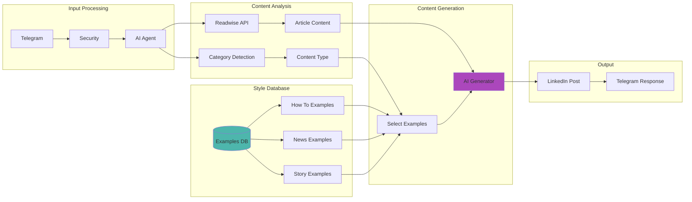
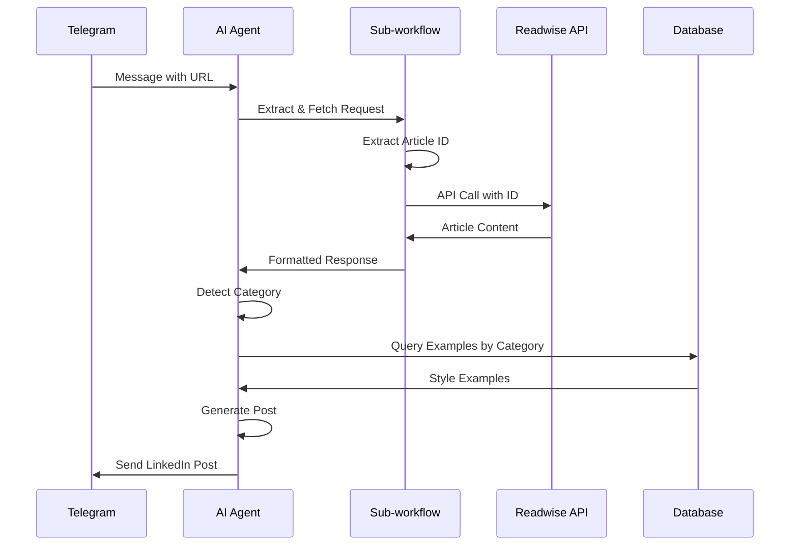
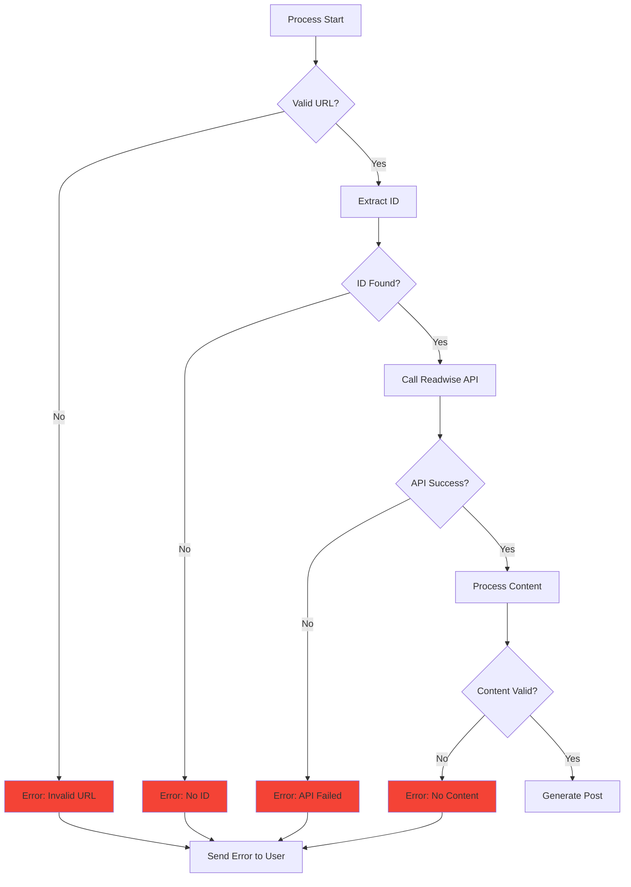
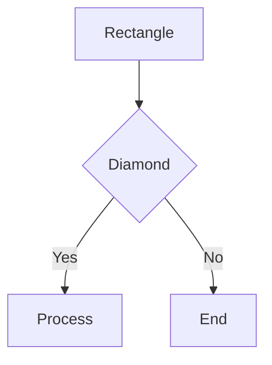
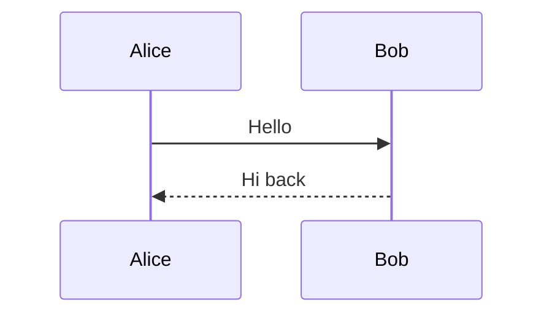
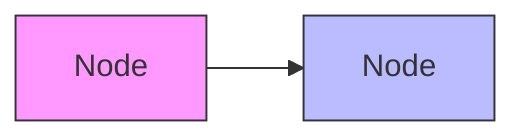

# Workflow Documentation with Mermaid

## Your Current Workflow

## Enhanced Workflow with Database Examples

## Human Approval Workflow

## Database-Enhanced Architecture

## Detailed Sub-workflow Flow

## Error Handling Flow

## Tools for Creating Mermaid Diagrams

### **1. Online Editors**
- **Mermaid Live Editor**: https://mermaid.live/
- **Draw.io**: Supports Mermaid syntax
- **GitHub/GitLab**: Native Mermaid support in markdown

### **2. Documentation Integration**
- **Notion**: Supports Mermaid blocks
- **Obsidian**: Mermaid plugin
- **VS Code**: Mermaid preview extensions

### **3. Export Options**
- PNG/SVG images
- PDF documents
- Interactive HTML

## Mermaid Syntax Cheat Sheet

### **Basic Flowchart**

### **Sequence Diagram**

### **Styling**

## Documentation Best Practices

1. **Keep diagrams focused** - One concept per diagram
2. **Use consistent styling** - Same colors for same types
3. **Add clear labels** - Descriptive node names
4. **Include error paths** - Show what happens when things fail
5. **Version control** - Track changes to your workflow